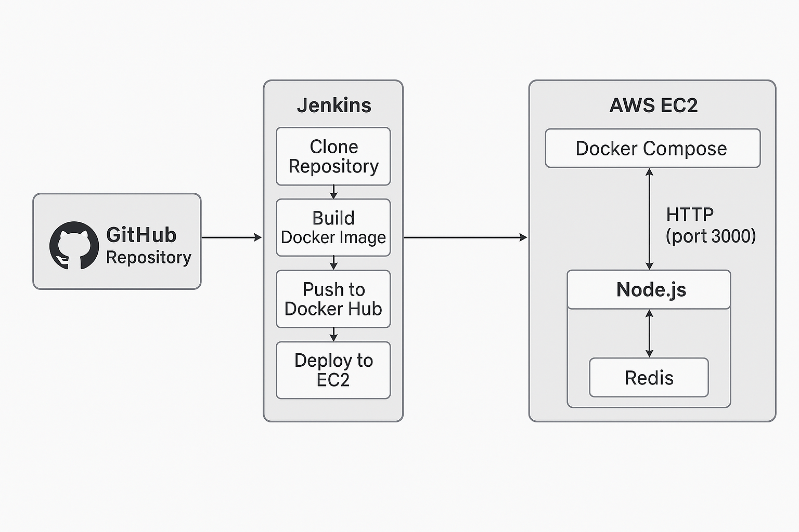

# 🚀 Full DevOps Project — Node.js + Redis + Docker + Jenkins CI/CD + AWS EC2 Deployment

This repository contains a complete end-to-end DevOps project that includes:

1. A Node.js + Redis application  
2. Docker containerization  
3. Multi-container orchestration using Docker Compose  
4. CI/CD pipeline using Jenkins  
5. Automatic deployment to AWS EC2 using SSH  

This README explains everything from start to end in the simplest possible way.

---

## 📌 1. Project Overview

This is a simple Node.js application that increments and displays the number of visits:

Number of visits: <count>


Redis stores the visit count so that data persists even after restarting containers.

### You will learn how to:

- Dockerize the application  
- Run a multi-container setup (Node.js + Redis)  
- Push Docker images to Docker Hub  
- Create an automated CI/CD pipeline in Jenkins  
- Deploy the application to AWS EC2  

## 🖼 Architecture Diagram



---

## 📂 2. Project Structure

\`\`\`
docker-practice/
├── Dockerfile
├── docker-compose.yml
├── index.js
├── package.json
├── package-lock.json
└── README.md
\`\`\`


---

## 🐳 3. Dockerfile Explanation

Your Dockerfile performs the following steps:

1. Uses the official Node.js image  
2. Sets the working directory `/app`  
3. Copies package.json and installs dependencies  
4. Copies source code  
5. Exposes port **3000**  
6. Starts the Node.js application  

---

## 🧩 4. docker-compose.yml Explanation

This project uses **two containers**:

### 1️⃣ Redis Container
- Image: `redis:alpine`  
- Uses `redis-data` volume for data persistence  
- Runs inside `app-net` network  
- Includes Redis healthcheck  

### 2️⃣ App Container
- Built from the Dockerfile  
- Depends on Redis health  
- Uses environment variables:  
  - `PORT=3000`  
  - `REDIS_HOST=redis`  
  - `REDIS_PORT=6379`  
- Exposes port `3000:3000`  
- Includes healthcheck  

Docker Compose simplifies running both containers together.

---

## 💻 5. Run Locally

### Clone the repository:

```bash
git clone https://github.com/Vysh-reddy-boddu/docker-practice.git
cd docker-practice

## Start the app:
```bash
docker compose up -d

## Check logs:
```bash
docker compose logs app

## Open in browser:

http://localhost:3000

### 📦 6. Docker Hub Image
The Jenkins pipeline pushes the image to Docker Hub:
```bash
vyshnaviboddu/node-app:latest
pull manually:
```bash
docker pull vyshnaviboddu/node-app:latest

### 🔧 7. Jenkins CI/CD Pipeline Workflow
Jenkins stages:
## Stage 1 — Clone GitHub Repository
```bash
git clone https://github.com/Vysh-reddy-boddu/docker-practice.git
## Stage 2 — Build Docker Image
```bash
docker build -t vyshnaviboddu/node-app:latest .
## Stage 3 — Login to Docker Hub
## Stage 4 — Push Docker Image
```bash
docker push vyshnaviboddu/node-app:latest
## Stage 5 — Deploy to AWS EC2 (via SSH
Commands executed on EC2:
```bash
cd docker-practice &&
docker compose pull &&
docker compose up -d
This automatically updates the running application on AWS.
### ☁️ 8. AWS EC2 Deployment
Your EC2 instance contains:

- Docker

- Docker Compose v2

- SSH key access configured for Jenkins

- Port 3000 opened in the security group
Access your application at:
http://43.204.97.108:3000
